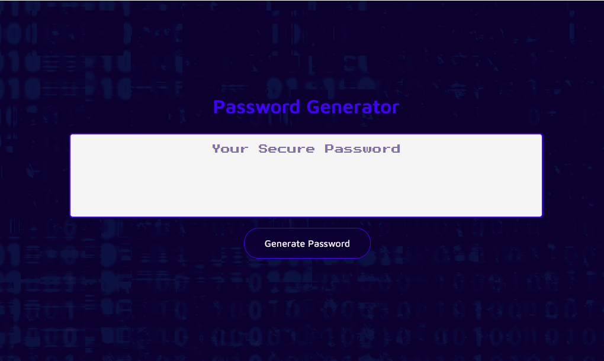

# Password Generator

A web application for generating a random password. Users can choose the length and character sets included in the password. Leverages browser's built in alerts and prompts.

Visit here: https://theodoremoreland.github.io/PasswordGenerator/

### Additional features

- Input validation
- Automated Unit / Integration Tests
- Responsive w / mobile first design
- Music
- Sound effects

### Technologies Used

- HTML5
- CSS3
- JavaScript (ES6)
- Jest

# Screenshots

## Default view (Galaxy Fold emulation)

## Default view

## Initial prompt (for desired length of password)

## Second prompt

## Third prompt

## Fourth prompt

## Fifth prompt

## Result

